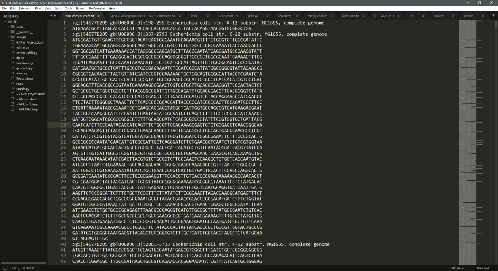
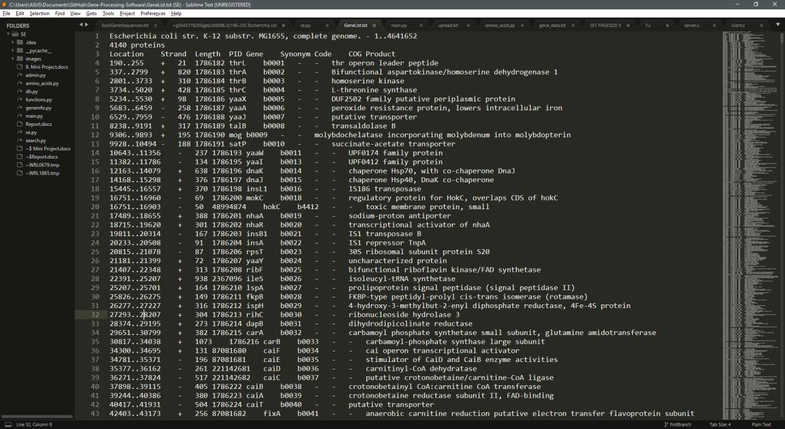
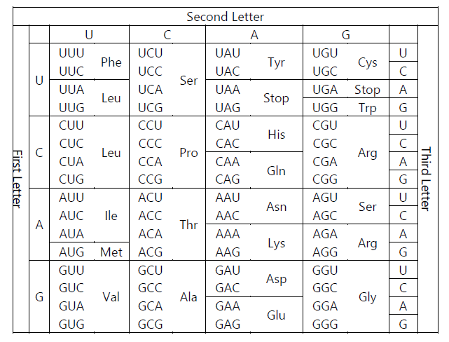
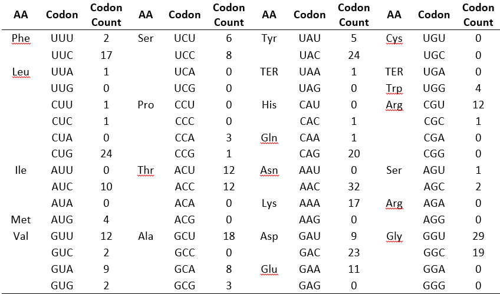
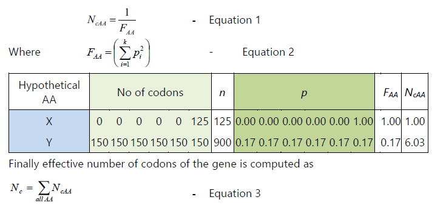
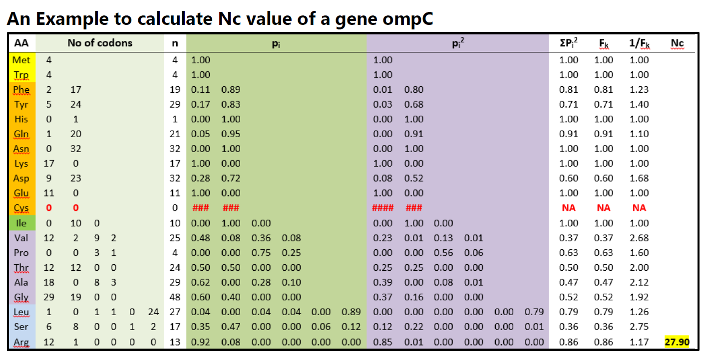
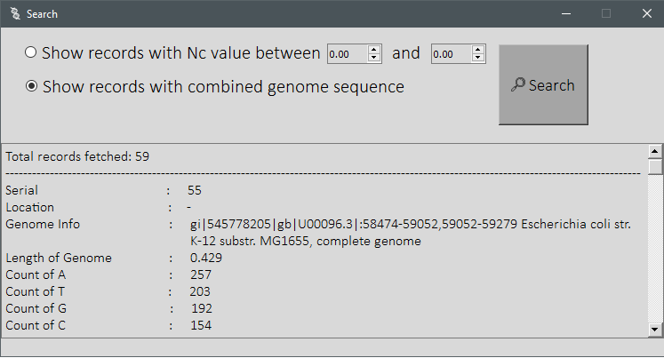
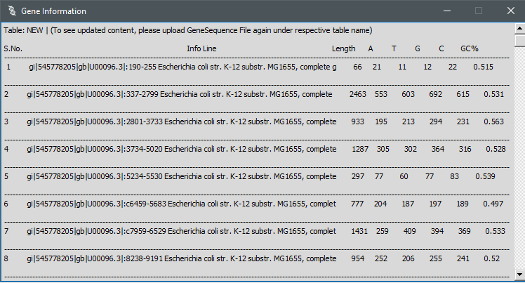
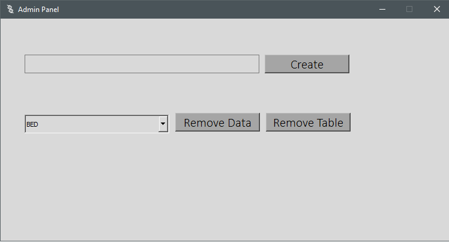
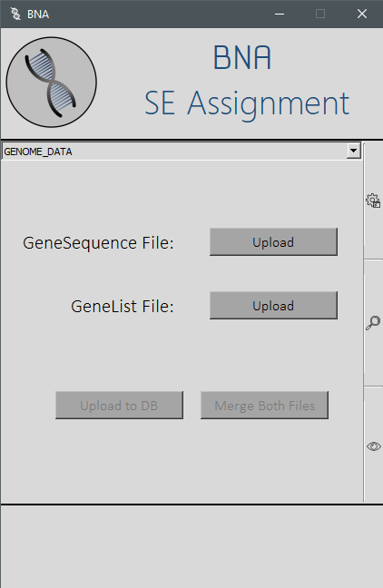

# Gene-Processing-Software

**Introduction:**

The software takes in two file which contains gene records and other related information, it, then validate those files and if they&#39;re in correct format, it uploads them into the database and also can merge contents of both files based on some common value.

The software then calculates the amino acid sequence of the genome sequence for each records and then based on that, it calculates the Effective Number of Codons (Nc value) for each record.

All the tasks that this software performs are listed below:

**Task 1: Perform Validation**

In this task, an input file is uploaded which contains genome information and is then validated based on following criteria.

- Genome Sequence for each record only has ATGC characters
- Each records begins with \&gt; character
- Information Line must be given in a single line only
- Information line cannot be in two consecutive rows
- There should not be ay blank lines in the file

After validating Fasta File, its contents are stored in a file in a formatted manner (it is then used for reference in task 2). Each record&#39;s information is stored in single line only.

No validation is required for second file (Gene List File).

Fasta File and Gene List File are in following format

**Task 2: Calculate some values and upload to database**

In this task, software calculates few extra values based on the content of a genome record, these values are:

Length of genome sequence, count of A, count of T, count of G, count of C and GC%.

GC% = (count of G + count of C) / length of genome sequence

After calculating these values, they&#39;re written to a new file where all the information is stored which is to be uploaded into the database. And as genome sequence in being processed in this task, the software also calculates the Amino Acid Sequence for the given genome sequence in this task and then all these information is ready to be uploaded into the database. When user clicks on Upload button, all this gets uploaded to the database.

This information is used to produce protein which is a sequence of 20 amino acids. The standard version of the genetic code table presents 64 nucleotide triplets (or codons) that include 61 sense codons and three stop codons. This table defines a translational mapping from 61 sense codons to 20 amino acids.

**Task 4: Merge both files&#39; content and upload**

The gene list file&#39;s content are merged with the contents of Fasta file and it is then uploaded into the database.

This second file&#39;s data is merged with Fasta file based on a common key attribute i.e., location which is defined in each Genome Record (in Fasta File) and that is used for comparison then merging. No intermediate files are generated in this phase as merging is done directly in the database.

**Task 3: Calculate Effective Number of Codons**

Firstly, we calculate the codon usage for every genome record as shown below:

**Codon Usage**

Once this is calculated we calculate the Effective Number of Codons for each record.

Effective number of codons (Nc, Wright 1990) is a method of measuring overall degree of codon usage bias in a gene. It measures biasness from equal usage of alternative synonymous codons in a gene. It takes the value of 61(for standard genetic code) when all the synonymous codons are used with equal frequency, and its value decreases to as low as 20 when synonymous codon usages become highly biased.

For an amino acid _AA_ with degeneracy _k_, i.e. with _k_ number of synonymous codons, each with counts _n __1_, _n__ 2_,…, _n __k_, _n_ as the total codon count, and _p__ i_= _n__i_ / _n_, effective number of codons of the _AA_ is calculated as follows:

After calculating this Nc for all records, it is then uploaded into the database as well.

**Task 4: Search and Display**
Once all the data is processed and uploaded into the database, it is ready to be displayed based on the search criterias that user gives for Nc value. Also, those records which have combined genome sequences can also be displayed separately.

*Search UI*

*Quick Display UI*

**Task 5: Admin Panel**

The admin panel is designed to create new database for a new organism, delete existing database and delete contents of a database.

Home Screen of the software:

